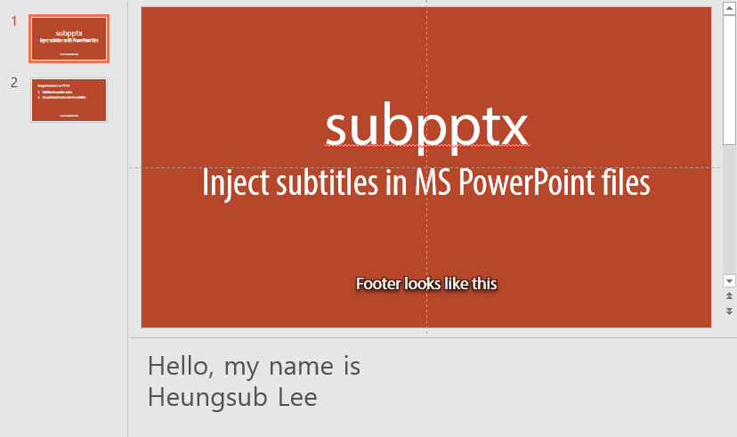

# subpptx

`subpptx` is a tool which injects subtitles in MS PowerPoint (`.pptx`) files.
This tool will makes footers for every slides from their slide notes.

## Usage

There are two prerequisites:

1. subtitles in speaker notes
2. an optimized footer style for subtitles

If you have a ready `.pptx` file, do:

```console
subpptx <pptx> <output>
```

## Example

Here's a subtitle-ready PPTX:



Now inject subtitles via `subpptx`:

```console
subpptx subpptx.pptx output.pptx
```

You can get a new PPTX file with subtitles:

